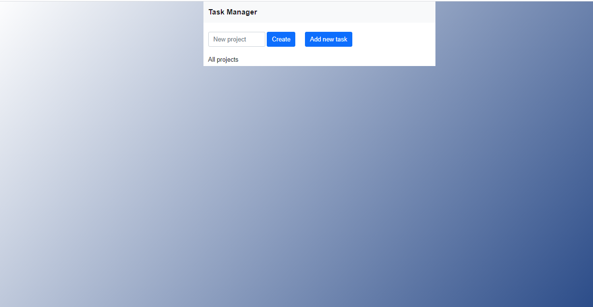

# Todo_app.

In this project, I built a simple Todo App using Webpack and ES6 by dynamically creating a majority of the DOM elements. Local storage was used to persist data across the user's session. It is a web application that helps you organize your task according to projects.

- DOM Manipulation with JavaScript
- LocalStorage
- Bootstrap



## Built With

- HTML
- JavaScript
- Webpack
- BootStrap

## Live Demo

[Live Demo Link](https://jovial-lichterman-4432e1.netlify.app/)

## Getting Started

To get a local copy of the repository please run the following commands on your terminal:

```bash
$ git clone
$ cd <folder>
$ cd Todo_app
$ npm install
$ npm run start
```

## Testing

To run automated tests, in your terminal, change into the directory containing this project and run this command: `npm run test`.

## Author

👤 **Popoola Grace Boluwatife**

- Github: [@GraceOyiza](https://github.com/GraceOyiza)
- Twitter: [@\_PopsonGrace](https://twitter.com/_PopsonGrace)
- LinkedIn: [@grace](https://www.linkedin.com/in/grace-popoola)

## 🤝 Contributing

Contributions, issues and feature requests are welcome!

Feel free to check the [issues page](https://github.com/GraceOyiza/Todo_app/issues).

## Show your support

Give a ⭐️ if you like this project!
